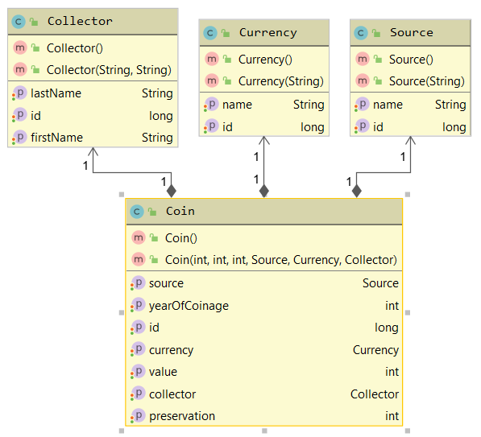

# Florian Schwarcz

This project is a simple ReST application that is used to store and retrieve data about a coin collection.

The server relies on a postgres database that can be accessed by the following url:

`jdbc:postgresql://192.168.99.100:5432/postgres` (default VM docker address)

By default the credentials are user:`postgres` password:`admin`.

You can setup your own dockered postgres by executing `docker-compose up` in the project's root directory. Beware that the url might not be 192.168.99.100 if you are not using a docker with VirtualBox.

If your database credentials do not match you can change them in the `application.properties` file.

## Entities

A coin in the collection was provided by a certain collector and can be found in a certain source container where other coins are also stored. In a collection there can be coins of different values and currencies, e.g. 10 Groschen or 500 Schilling.

